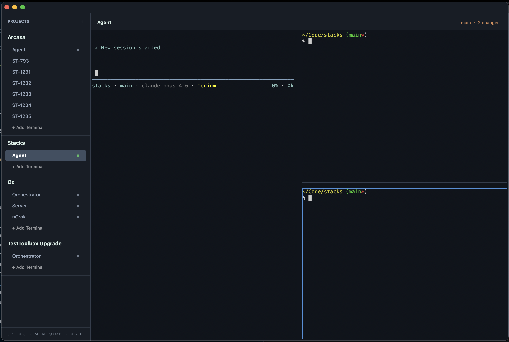

<p align="center">
  
</p>

<h1 align="center">Stacks</h1>

<p align="center">A native macOS terminal emulator and multiplexer built for developers who organize their work around projects. Group your terminals, split your panes, and get back to what you were doing — instantly.</p>

<p align="center">
  
</p>

<p align="center"><em>Built with Zig and ObjC on AppKit. ARM (Apple Silicon) only for now.</em></p>

## Features

- **Project/group management** — organize terminals by renamable project/group (see screenshot: Arcasa, Stacks, Oz, TestToolbox Upgrade)
- **Multiple terminals per project/group** — each with optional startup commands (Startup commands like pi, claude, npm run dev, etc. See screenshot: Agent (both instances have startup commands), ST-793, ST-1231...I create a terminal inside a project for each feature (ST-793, ST-1231, etc) and use worktrees + agents in each terminal to get work done.)
- **Split panes** — horizontal (⌘D) and vertical (⇧⌘D) splits with draggable resizing (see screenshot)
- **Sidebar** — drag-and-drop reordering of terminals and projects/groups (see screenshot)
- **Full terminal emulation** — via libvterm (xterm-256color)
- **Scrollback** — 10,000 line history with mouse wheel scrolling
- **Git branch display** — header bar shows branch and change count from the terminal's live cwd (screenshot: top right)
- **Copy/paste** — select to copy, ⌘V to paste with bracketed paste mode
- **File drag-and-drop** — drop files into terminal panes (auto-escapes paths)
- **Bell notifications** — blue dot in sidebar for background terminal activity
- **Process status indicators** — green/gray dots for command-based terminals (running = green, gray = not running, see screenshot)
- **Persistent state** — projects, terminals, splits, cwds, font size, and window frame saved across launches
- **Auto-update** — checks GitHub releases on startup and hourly, with in-app update dialog
- **Box-drawing rendering** — Unicode box characters drawn with CoreGraphics for pixel-perfect table borders

## Keyboard Shortcuts

| Shortcut | Action |
|----------|--------|
| ⌘T | New terminal in current project |
| ⌘D | Split horizontal |
| ⇧⌘D | Split vertical |
| ⌘W | Close pane |
| ⌘] / ⌘[ | Cycle focus between panes |
| ⌘= / ⌘- / ⌘0 | Font size increase/decrease/reset |
| ⌘⇧] / ⌘⇧[ | Navigate sidebar (highlight only) |
| ⌘Enter | Activate highlighted sidebar item |
| ⌘V | Paste with bracketed paste mode |
| ⌘K | Clear terminal screen and scrollback |
| ⌘O | Add project/group |
| ⌘Q | Quit |

## Architecture

```
src/
├── main.zig                Entry point
├── app.zig                 Central app state (wraps ProjectStore)
├── project.zig             Project/terminal data model + JSON persistence
├── objc.zig                ObjC runtime bindings
├── vt.zig                  libvterm wrapper
├── pty.zig                 PTY/fork management
├── version.zig             Build-time version embedding
├── updater.zig             Auto-update checker (GitHub releases)
└── ui/
    ├── window.zig          App delegate, window, header bar, menu bar
    ├── sidebar.zig         Project list, drag-and-drop, navigation
    └── term_text_view.zig  Terminal grid rendering, input, selection, splits
```

## Building

### Prerequisites

- **Zig 0.15+**
- **libvterm** (Homebrew): `brew install libvterm`
- **macOS** with Apple Silicon (ARM64)

### Build & Run

```bash
zig build                    # compile
bash scripts/install.sh      # deploy to ~/Applications/Stacks.app
open ~/Applications/Stacks.app
```

## Releases

See [GitHub Releases](https://github.com/richcorbs/stacks/releases) for downloads and release notes.

Release notes are also tracked in the [`releases/`](releases/) directory.

## Data

- **Projects**: `~/Library/Application Support/stacks/projects.json`
- **Window frame**: persisted via `setFrameAutosaveName:` ("StacksMainWindow")
- **App icon**: `resources/AppIcon.icns`
